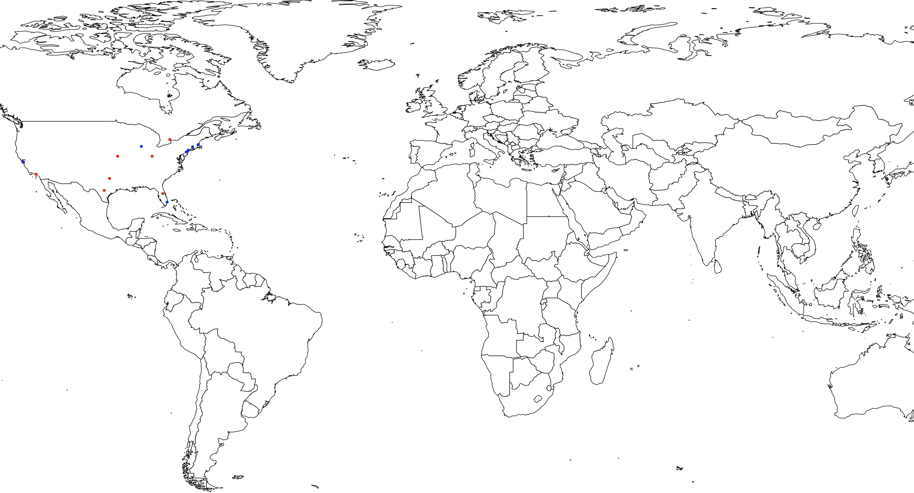

<a href="http://bitly.com/2grT54q"></a> <a href="http://bitly.com/2grT54q"></a> 
 [](https://www.paypal.com/cgi-bin/webscr?cmd=_s-xclick&hosted_button_id=WX4EKLLLV49WG)
 
# R_searchandMap_Function
A R function that make easy to search to concurant terms tweeted word through the api and world Map tweets :


## Requeriement
Please install and load first those library before making usage of the function
library("tm")
library("map")
library("mapdata")
library("twitteR")

## Installation
Very simple Drag this function in your R terminal or in you Rstudio IDE

```R
searchandMap <- function(s1,s2)
{
  # search for a word
  S1 <- searchTwitter(s1, since="2016-01-01", n=1000)
  # search for another word
  S2 <- searchTwitter(s2, since="2016-01-01", n=1000)
  S1.df <- twListToDF(S1)
  S2.df <- twListToDF(S2)
  # filter only geolocalized tweet in both search
  na.omit(S1.df$latitude)
  na.omit(S1.df$longitude)
  na.omit(S2.df$latitude)
  na.omit(S2.df$longitude)
  print(S2.df$longitude)
  print(S2.df$latitude)
  print(S1.df$longitude)
  print(S1.df$latitude)
  S1.x <- S1.df$longitude
  S1.y <- S1.df$latitude
  S2.x <- S2.df$longitude
  S2.y <- S2.df$latitude
  # map the result on a MAP
  map("world", fill=TRUE, col="white", bg="white", ylim=c(-60, 90), mar=c(0,0,0,0))
  points(S1.x,S1.y, col="red", pch=20)
  points(S2.x,S2.y, col="orange", pch=20)
  # Use system voix to annonce the end of processing, Mac only sorry  
  system("say Processing is Done")
}
```
## usage
```R
searchandMap("pizza", "game")
searchandMap("xbox", "ps4")
```
that gives:



## changing setting
This function was made to look tweet only in french you can feel free to change those parameters
```R
    # Change search parameters
    searchTwitter(s1, since="2016-01-01", n=1000)
    # Change country Mapping
    map('worldHires','USA')
```
You can focus the search on only a country
## TIPS and Tricks
